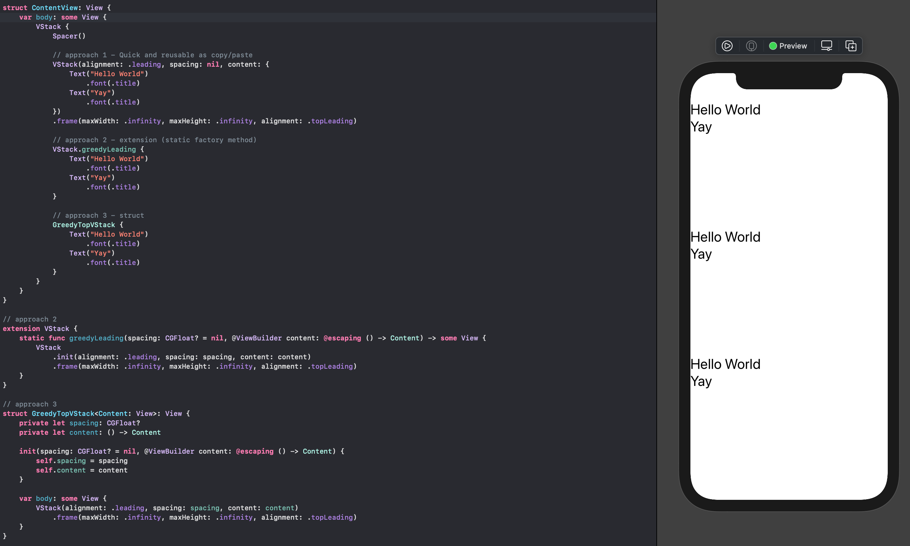

# SwiftUIStaticFactoryMethodApp

Three different ways to modify a SwiftUI view and abscration approaches through static factory method or a struct.

Xcode 12.4
[Based on a Twitter thread](https://twitter.com/steipete/status/1376891848606769154)

